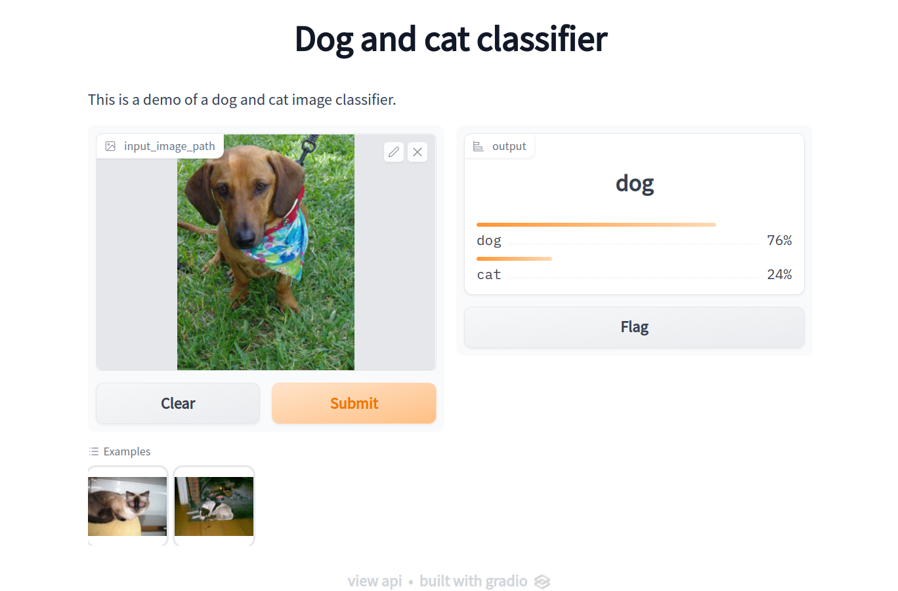

# Deep Learning in Computer Vision with PyTorch

**[How To Get Started With Computer Vision In 2023?](https://pub.towardsai.net/how-to-get-started-with-computer-vision-in-2023-9731d058bac1), Towards AI**.

This repository gives you a walkthrough of training and testing image classification and semantic segmentation algorithms on custom datasets. Finally, it shows how to build and run a simple web interface so that anyone can use it!



## Contents

1. Train image classification model to recognize dogs and cats
2. Train semantic segmentation model to segment skin lesions from dermoscopic images
3. Build a web interface using the image classification model
4. If you want to go beyond, have a look at [Build and Deploy Custom Docker Images for Object Recognition
](https://pub.towardsai.net/build-and-deploy-custom-docker-images-for-object-recognition-d0d127b2603b)

## Setup

Create a fresh conda environment.

```bash
# clone
git clone https://github.com/hasibzunair/cv-pytorch-tutorials
cd cv-pytorch-tutorials
# create fresh conda environment
conda create -n cvp python=3.8
conda activate cvp
conda install pytorch torchvision torchaudio pytorch-cuda=11.6 -c pytorch -c nvidia
pip install gradio
```

or use env file:

```bash
conda update conda
conda env create -f environment.yml
conda activate myenv
```

## How to run?

You can simply run the notebooks in order. Datasets are available [here](https://github.com/hasibzunair/cv-pytorch-tutorials/releases/tag/v1). Make a new folder in the project folder called `datasets` and keep them there.

To run the web interface, you need to copy your trained image classification model named `model.pth` in the `web_interface` directory. Then simply run `python app.py`

## Related materials

Here is a list of my related tutorials that could be useful to look at.

* [Intro to Deep Learning](https://github.com/hasibzunair/neural-nets-for-babies)
* [Intro to Python](https://github.com/hasibzunair/ieee19-py)
* [Intro to TensorFlow](https://github.com/hasibzunair/ericsson-upskill-tutorials)
* [Intro to Image Processing and Computer Vision](https://github.com/hasibzunair/ieee18-cv)
* [Intro to Image Classification with Python and Keras](https://github.com/hasibzunair/whats-image-classifcation-really)
* [Build 3D image classification models from CT scans](https://keras.io/examples/vision/3D_image_classification/)

This repo is built using code examples from [hasibzunair/learn-pytorch](https://github.com/hasibzunair/learn-pytorch).
